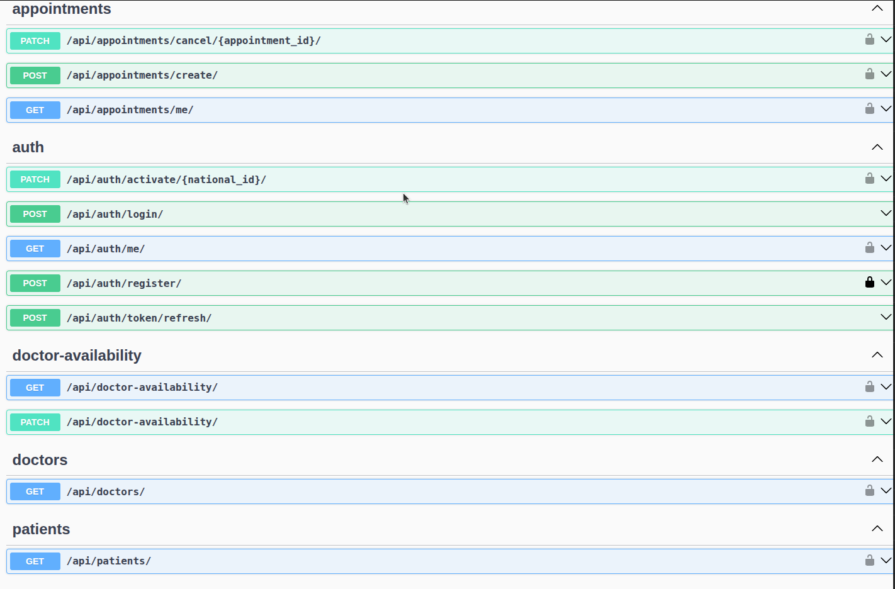

# healthcare-appointment-system

Backend: Django, Postgresql, OpenApi
'./backend/README.md'

Frontend: React, TypeScript

# Setup:

```bash
git clone https://github.com/Boonerd/healthcare-appointment-system --depth 1 && cd healthcare-appointment-system
```

```bash
# navigate to your desired folder to setup backend and frontend
cd backend

cd frontend
```


